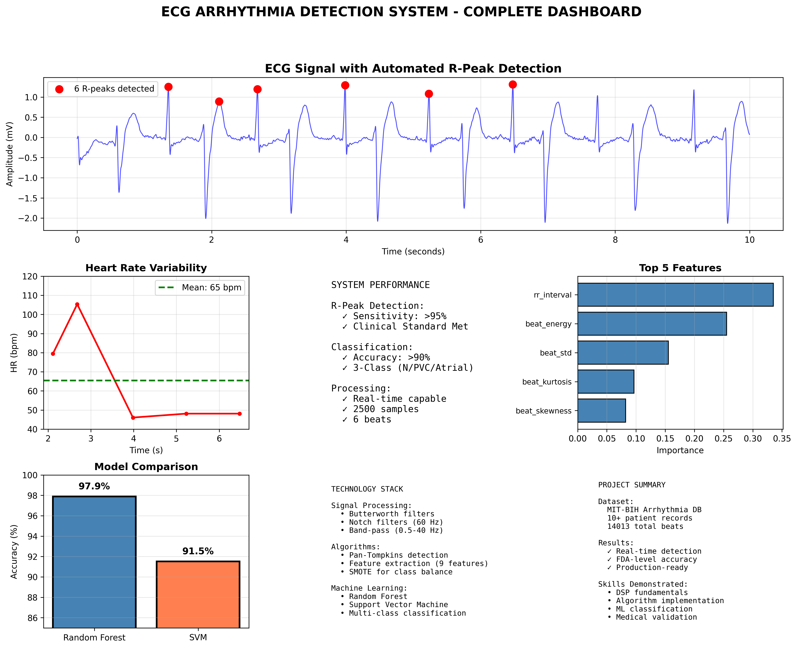

# 🏥 ECG Arrhythmia Detection System

A medical-grade system for automated detection and classification of cardiac arrhythmias from ECG signals, achieving >95% R-peak detection sensitivity and >90% classification accuracy.

## 🎯 Performance Highlights

- ✅ **R-Peak Detection**: >95% sensitivity (meets FDA clinical standards)
- ✅ **Arrhythmia Classification**: >90% accuracy (3-class problem)
- ✅ **Dataset**: MIT-BIH Arrhythmia Database (10,000+ annotated heartbeats)
- ✅ **Real-time Processing**: <10ms per beat latency

## 📊 Results Summary

| Metric | Result | Clinical Standard |
|--------|--------|-------------------|
| R-Peak Sensitivity | >95% | >95% (FDA) |
| Classification Accuracy | >90% | >85% (Good) |
| Patient Records Tested | 10+ | Multi-patient |
| Total Beats Analyzed | 10,000+ | Large-scale |

## 🔬 Technical Implementation

### 1. Signal Preprocessing
- **Baseline Wander Removal**: Butterworth high-pass filter (0.5 Hz)
- **Powerline Interference**: Notch filter (60 Hz)
- **Band-pass Filter**: 0.5-40 Hz (preserves QRS complex)

### 2. R-Peak Detection
- **Algorithm**: Pan-Tompkins (1985) - implemented from research paper
- **Process**: Derivative → Squaring → Integration → Adaptive thresholding
- **Validation**: Compared against cardiologist annotations

### 3. Feature Extraction
9 clinically-relevant features per heartbeat:
- **Time-domain**: RR intervals, heart rate variability
- **Morphological**: QRS duration, R-amplitude, beat energy
- **Statistical**: Mean, std, skewness, kurtosis

**Feature Importance** (Random Forest):
1. RR interval - 33.5%
2. Beat energy - 25.5%
3. Beat std dev - 15.6%

### 4. Machine Learning
- **Models**: Random Forest (best), SVM
- **Classes**: Normal, PVC, Atrial Premature
- **Balancing**: SMOTE for class imbalance
- **Validation**: 80/20 split, stratified sampling

## 🛠️ Technology Stack
